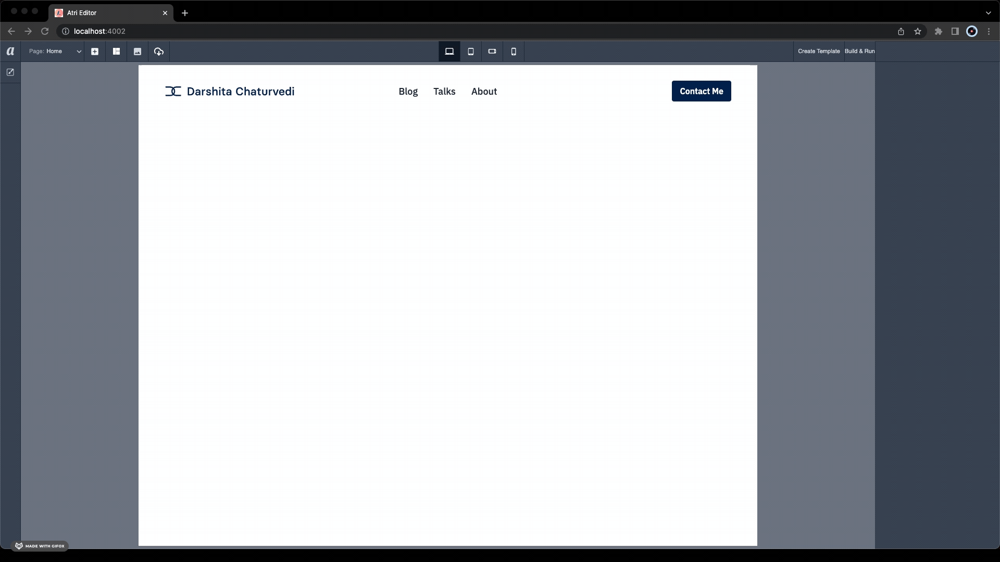

# Atri Templates
Common requirements in frontend that are packaged in ready-to-use form. 

For example, responsive navigation bar with three columns is shown below. 

[File location](templates/basics/responsive_navigation_bar.json)



Find the complete list and details of available templates [here](templates/README.md).

## How to use a template?

1. Copy contents of the JSON file from this repository. 

For example, if you want to use `responsive_navigation_bar` template in `atri-templates/templates/basics/responsive_navigation_bar.json`, visit the link and copy its contents by clicking on the `Copy raw contents` icon in GitHub. 

2. Create a new JSON file inside a corresponding folder (e.g. `basics`, `layout`, etc.) in `atri_templates` directory in your Atri app root directory. 

Continuing with our example, create a `atri-templates/basics/responsive_navigation_bar.json` and paste the contents of the file here. 

We will be releasing a CLI in our future versions to make this process easier. Stay tuned!

## How to contribute?

1. Create a [fork of this repository](https://docs.github.com/en/get-started/quickstart/fork-a-repo#forking-a-repository). 

2. [Clone](https://docs.github.com/en/get-started/quickstart/contributing-to-projects#cloning-a-fork) your fork. 

```shell
# Clone your fork of the repo into the current directory
git clone https://github.com/Atri-Labs/atri-templates.git
```

3. Configure the remotes. 

```shell
# Navigate to the newly cloned directory
cd atri-templates

# Assign the original repo to a remote called "upstream"
git remote add upstream https://github.com/Atri-Labs/atri-templates.git
```

4. Add JSON file for a template in `basics` or `layout` folder or create a new folder. 

5. Add details the template in [Readme](templates/README.md). 

6. Open a [Pull Request (PR)](https://docs.github.com/en/pull-requests/collaborating-with-pull-requests/proposing-changes-to-your-work-with-pull-requests/creating-a-pull-request-from-a-fork) with clear title and description.

## Resources
📚 Read the [Docs](https://docs.atrilabs.com/)

🧭 Follow Atri Labs on [LinkedIn](https://www.linkedin.com/company/atri-labs)

💬 Join our [Slack community](https://join.slack.com/t/atricommunity/shared_invite/zt-1e756m1at-bZBxngvw7KWWO0riI4pc0w)

❓ Share any [bugs](https://github.com/Atri-Labs/atrilabs-engine/issues) or ask any question in [Discussions](https://github.com/Atri-Labs/atrilabs-engine/discussions)

🎥 Watch along on [YouTube](https://www.youtube.com/channel/UC1uR2Q5x_8olWS_Y4PdK1Bw)

⭐️ Star [Atri framework](https://github.com/Atri-Labs/atrilabs-engine) if you find it helpful! 😎